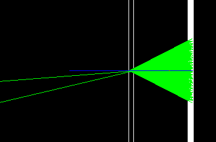
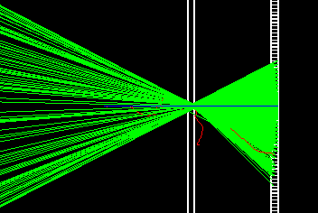
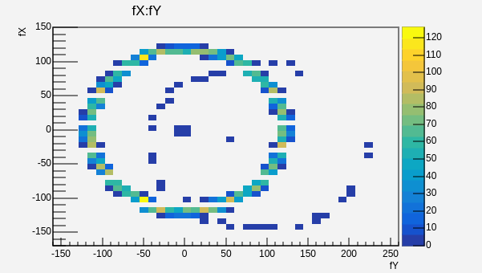

# A Geant4 simulation for a Cherenkov detector
## Introduction
In this code I simulate a simple Cherenkov detector using the Geant4 toolkit, my detector is a matrix of 100*100 small photon sensors, and I use a thin radiator from Aerogel material. Let's introduce some definitions before installing the code.

### Cherenkov radiation :
Cherenkov radiation is electromagnetic radiation emitted when a charged particle passes through a dielectric medium at a speed greater than the phase velocity of light in that medium. This electromagnetic radiation takes a shape of a ring in the same direction as the particle momentum.


Here is an image from my simulation for a Cherenkov ring from a single particle



Another image from my simulation for a Cherenkov ring from 100 particles crossing the radiator



And that is how he last ring appears in our photon detectors



### Code description: 

To do a full simulation in geant4, you need to create different files which describe different classes needed for your simulation. In the case of our code and in the following lines, I will describe the function of each file included in the code.

**First**, every code contains source files and header files, that is required for the classes definitions

- **CMakeLists.txt:** It is very important and required file for every geant4 simulation to define the Setup of the project, and to locate sources and headers for this project, and to add the executable, and link it to the Geant4 libraries.

- **sim.cc:** It is the main program of the Cherenkov-detector g4 simulation, which contains the definition of the main function, and constructs the default run manager. It also initializes the visualization, and you can add command lines which usually be used in the macro file to control the visualization and extra.

- **geometry.cc and geometry.hh:** geometry.cc (sometimes called construction.cc)is the file that is responsible for describing the different volumes used in the simulation. It is also responsible for defining he material used to fill these volumes. The header file geometry.hh is used for initializing the class needed to describe our source file, in our case here it is DetectorConstruction.

- **physics.cc:** physics.cc is the file where you will add the physics list that is needed to describe your detector, in our case, we need to metion the optical section.

- **action.cc:** is important for the Implementation of the ActionInitialization class. It is also used to introduce Generator and run action definition.

- **run.cc:** Used for the implementation of the RunAction class, and the analysis you want to do during the simulation, and to Create ntuples.

- **detector.cc:** Used for the implementation of the SensitiveDetector class, and to define the track or the particle hits in the detector, which is used later to do the analysis.

- **generator.cc:** Used to implement the PrimaryGeneratorAction class, which is resposiblie for particle definition and particle kinematics.

## Installation


First clone the repository:
```bash
git clone https://github.com/mahmoudali2/Cheronkov-Simulation.git
```
Then create the build directory on the same level as the cloned file and start the installation:
```bash
mkdir build
cd build
cmake ../
make 
```
Finally, to run the simulation 
```bash
./sim
```

This code is done by version v11.1.0 of geant4, so you may face some problems in installing if you use older versions.

## Contributing

Pull requests are welcome. For major changes, please open an issue first
to discuss what you would like to change.

Please make sure to update tests as appropriate.
